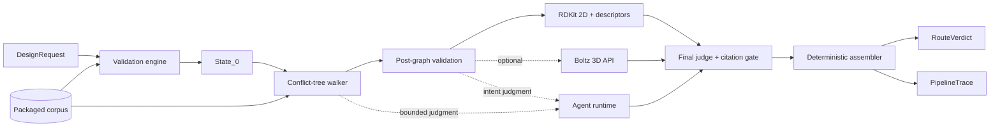

# Route Agent

Synthesizability checker for designed peptide analogs. It accepts a parent
peptide, requested modifications, and a design intent, then returns a
schema-valid route verdict with a proposed synthesis route, conflicts,
uncertainties, and provenance.

The repository exposes the same core pipeline through three interfaces:

| Interface | Best for |
| --- | --- |
| `route-agent` CLI | Automation, batch work, evaluation, and the canonical JSON contract |
| `route-agent-api` | Local asynchronous jobs consumed by Trace Explorer |
| `trace-viewer/` | Creating requests and inspecting validation, route trees, molecular checks, model calls, and raw traces |

Python 3.12+ is required. The React UI additionally needs a current Node.js
release and npm. Docker is optional and only used by the local observability
stack.

## Quick start from source

Install [`uv`](https://docs.astral.sh/uv/), clone the repository, and run:

```bash
uv sync --frozen
uv run route-agent doctor --no-model
```

Create `request.json`:

```json
{
  "request_id": "REQ-DEMO",
  "parent_name": "glucagon",
  "sequence": "HSQGTFTSDYSKYLDSRRAQDFVQWLMNT",
  "parent_c_terminus": "free_acid",
  "residue_annotations": {},
  "parent_features": [],
  "modifications": [
    {
      "family": "lipidation",
      "site": "K12",
      "detail": "C18-diacid via 2xAEEA-gGlu spacer"
    }
  ],
  "intent": "extend plasma half-life via albumin binding"
}
```

Run the complete pipeline without external model calls:

```bash
uv run route-agent run request.json --no-model --explain -o verdict.json
```

`--no-model` still performs request validation, corpus lookup, route-tree
construction, RDKit 2D validation, and deterministic verdict assembly. Any
decision that genuinely needs model judgment remains unknown, so the final
result may be `insufficient_information` with low confidence.

For live judgment, configure a provider and rerun without `--no-model`:

```bash
uv run route-agent config set-api-key anthropic
uv run route-agent doctor
uv run route-agent run request.json --explain -o verdict.json
```

The key is requested through a hidden prompt and stored in the system keyring.
On CI or headless hosts, use `ANTHROPIC_API_KEY` or `OPENAI_API_KEY`.
Environment variables take precedence over the keyring and secret values are
never printed by `config show`.

Detailed installation, configuration, and troubleshooting live in
[`docs/getting-started.md`](docs/getting-started.md).

## Install the package

Once published to PyPI:

```bash
pipx install peptaris-route-agent
route-agent doctor --no-model
```

To test the exact wheel from a checkout:

```bash
uv build
pipx install dist/peptaris_route_agent-*.whl
```

Runtime schemas, corpus data, molecular fragments, target templates, and the
official scorer are included in the wheel. Writable cache, configuration, and
data paths follow XDG conventions through `platformdirs`.

## Input and output contracts

`DesignRequest` requires:

- a unique `request_id` and human-readable `parent_name`;
- a non-empty one-letter peptide `sequence`;
- `parent_c_terminus`: `free_acid`, `amide`, or `alcohol`;
- annotations for every `X` in the sequence;
- one or more requested `modifications` with a supported family and site;
- a free-text design `intent`.

The final `RouteVerdict` contains:

| Field | Meaning |
| --- | --- |
| `verdict` | `feasible`, `feasible_with_changes`, `infeasible`, or `insufficient_information` |
| `confidence` | `high`, `medium`, or `low` |
| `resolved_sequence` / `resolved_annotations` | Sequence after deterministic transforms |
| `site_map` | Requested sites mapped onto the resolved sequence |
| `route` | Ordered synthesis operations |
| `conflicts` | Blocking, major, or minor route findings |
| `unknowns` | Missing evidence, skipped checks, or degraded infrastructure |

`run` writes only the public verdict to stdout (or `-o`). Logs and
`--explain` progress always go to stderr, making stdout safe to pipe into
another program. A richer internal `PipelineTrace` is written separately to
`traces/` by default.

## CLI

Public commands:

| Command | Role |
| --- | --- |
| `run REQUEST.json` | Full pipeline; emits one schema-exact `RouteVerdict` |
| `validate REQUEST.json` | Deterministic validation and `State_0`, not a final verdict |
| `config` | Set, remove, and inspect provider configuration |
| `doctor` | Check Python, packaged resources, RDKit, credentials, and writable directories |
| `debug` | Lower-level `agent`, `walk`, `post-graph`, and `eval` commands |

Common invocations:

```bash
route-agent run REQUEST.json [-o OUT.json] [--trace-dir traces] \
  [--model anthropic/claude-sonnet-4-5] [--reasoning high] \
  [--no-model] [--explain]
route-agent validate REQUEST.json [--output OUT.json] [--no-model] [--explain]
route-agent debug eval REQUESTS.jsonl --expected KEY.jsonl \
  [-o actual.jsonl] [--report EVAL_REPORT.md]
```

Logging controls:

| Flag | stderr behavior |
| --- | --- |
| default | Warnings and errors |
| `-v` | Pipeline progress |
| `-vv` | Debug diagnostics and tracebacks |
| `-vvv` | Internal trace detail |
| `-q` | Errors only |
| `--log-format json` | Structured records with timestamps and correlation IDs |
| `--explain` | Human-readable stage, tree, and state-diff view |

Exit codes:

| Code | Meaning |
| --- | --- |
| `0` | Success, including an honest schema-valid refusal from `run` |
| `1` | Missing file, invalid JSON, or invalid `DesignRequest` |
| `2` | Validation or agent failure in a diagnostic command |
| `3` | Missing infrastructure, failed required doctor check, or unexpected crash |

## Trace Explorer UI

Trace Explorer is a local React/Vite SPA. It can submit a request to the local
jobs API, reopen completed jobs, or inspect an uploaded `.trace.json` entirely
in the browser.

```bash
# terminal 1, repository root
uv run route-agent-api

# terminal 2
cd trace-viewer
npm ci
npm run dev
```

Open the Vite URL (normally <http://127.0.0.1:5173>). The UI provides:

- a validated `DesignRequest` form and trace-file drop zone;
- live job phases and activity;
- summary, validation, conflict-tree walk, molecular, intent, and final-judge views;
- model-call/cost inspection and the complete raw JSON trace;
- stable `/jobs/{job_id}?tab=...` URLs and request-ID lookup.

The API listens on `127.0.0.1:8000`; Vite proxies `/api` to it. It is a local
adapter, not a production multi-user service: one job runs at a time, active
state is in memory, there is no authentication, and CORS only allows the local
Vite origins. Completed job traces persist under
`traces/jobs/{job_id}/` and can be reopened after an API restart.

See [`docs/trace-explorer.md`](docs/trace-explorer.md) for the UI workflow and
HTTP endpoints.

## Architecture

The system is deliberately hybrid: deterministic code owns contracts and
chemistry invariants; bounded model calls handle compatibility, intent, and
final scientific judgment.



Pipeline stages:

1. **Validate** sequence, sites, family bindings, protecting groups, resin, and
   sequence transforms. This creates immutable `State_0`.
2. **Walk** candidate processes from the corpus. Each stage expands a directed
   conflict tree, updates a chemistry ledger, and prunes chemical failures.
3. **Post-graph** builds each surviving product, runs RDKit 2D validation and
   descriptors, optionally requests Boltz 3D coordinates, checks intent, and
   selects a winner.
4. **Judge** evaluates the winning route once and removes unverifiable
   citations while lowering confidence when evidence is weak.
5. **Assemble** reconstructs the route backwards from the winner and applies
   deterministic verdict, severity, and schema rules.
6. **Observe** emits in-process events, structured logs, optional Langfuse
   spans, and an atomic trace without changing domain decisions.

Three sibling Python packages enforce adapter boundaries:

| Package | Responsibility |
| --- | --- |
| `route_agent` | Domain models, chemistry, pipeline, observers, and composition |
| `route_agent_cli` | Click commands, terminal explanation, output discipline, and keyring |
| `route_agent_api` | FastAPI job adapter and persisted trace index |

`route_agent` never imports the CLI or API, and the API never imports the CLI.
Both adapters construct the same pipeline through
`route_agent.composition.wiring`. Architecture tests enforce these boundaries.

The complete package map, data flow, failure behavior, and trade-offs are in
[`docs/architecture.md`](docs/architecture.md).

## Architectural decisions

- **Deterministic ownership of the verdict.** The model cannot write
  `verdict`, alter enum values, decide site arithmetic, or bypass
  severity/confidence coherence.
- **Immutable state plus append-only evidence.** Pipeline states are frozen;
  errors, provenance, unknowns, and model calls remain auditable in the trace.
- **Fail honest, not optimistic.** Disabled models, timeouts, missing Boltz
  credentials, and uncertain evidence become explicit unknowns or degraded
  states rather than fabricated feasibility.
- **Corpus-driven branching instead of a conflict matrix.** Candidate process
  IDs come from `extracted_families.json`; compatibility is evaluated against
  the current ledger and cached by semantic state categories.
- **One core, thin adapters.** CLI, API, and UI do not duplicate chemistry or
  pipeline orchestration.
- **Public verdict separate from internal trace.** The stable schema remains
  small while the UI and diagnostics retain full intermediate state and costs.
- **Optional observability.** Langfuse and the local logging stack are
  fail-open and cannot determine pipeline success.
- **Local single-worker API by design.** It keeps the interview/demo runtime
  simple; production use would need durable jobs, authentication, quotas, and
  external storage.

## Configuration

Copy `.env.example` to `.env` for a source checkout, or set environment
variables directly. Important settings:

| Variable | Purpose |
| --- | --- |
| `ROUTE_AGENT_MODEL` | LiteLLM provider/model identifier |
| `ROUTE_AGENT_REASONING_EFFORT` | Default reasoning effort |
| `ANTHROPIC_API_KEY`, `OPENAI_API_KEY` | Live model credentials |
| `BOLTZ_API_KEY` | Optional 3D structure prediction |
| `ROUTE_AGENT_MOLECULAR_SKIP_3D` | Disable the Boltz block |
| `ROUTE_AGENT_CHECK_TIMEOUT` | Per-compatibility-check deadline |
| `ROUTE_AGENT_TRACE_PAYLOADS` | Include redacted model payloads in local traces/logs |
| `ROUTE_AGENT_LOG_DIR`, `ROUTE_AGENT_LOG_FORMAT` | Persist structured logs |
| `LANGFUSE_PUBLIC_KEY`, `LANGFUSE_SECRET_KEY`, `LANGFUSE_HOST` | Optional LLM tracing |

CLI `--model` and `--reasoning` override environment defaults for that
invocation. Resource and writable-path overrides are documented in
[`docs/getting-started.md`](docs/getting-started.md).

## Observability

The application works without Docker. For local Langfuse traces and
Vector/ClickHouse/Grafana dashboards:

```bash
mkdir -p .observability/logs
cp infra/.env.example infra/.env
docker compose -f infra/docker-compose.yml --env-file infra/.env up -d
./infra/smoke.sh
```

- Langfuse: <http://localhost:3000>
- Grafana: <http://localhost:3001>

The stack is fail-open: an unavailable collector or dashboard does not fail a
route run. Operational details and local-only credentials are in
[`infra/README.md`](infra/README.md).

## Development and verification

```bash
uv sync --frozen --group dev
uv run ruff check src tests scripts
uv run ruff format --check src tests scripts
uv run mypy src tests
uv run pytest tests -m "not live and not eval"

cd trace-viewer
npm ci
npm run lint
npm run typecheck
npm run build
```

The official offline evaluation uses the 12-case development set:

```bash
ROUTE_AGENT_MOLECULAR_SKIP_3D=true uv run pytest tests -m eval
```

`data/score.py` is the official scorer and must not be edited.
`EVAL_REPORT.md` is generated by evaluation, not maintained by hand. Live-model
evaluation is manual/weekly, requires a provider key, skips Boltz 3D, and is not
a release gate.

## Documentation

- [`docs/README.md`](docs/README.md) — documentation index
- [`docs/getting-started.md`](docs/getting-started.md) — setup, configuration,
  CLI/API/UI usage, and troubleshooting
- [`docs/architecture.md`](docs/architecture.md) — components, data flow,
  boundaries, persistence, failures, and design decisions
- [`docs/trace-explorer.md`](docs/trace-explorer.md) — UI and local jobs API
- [`docs/plan.md`](docs/plan.md) — detailed domain-process notes
- [`docs/releasing.md`](docs/releasing.md) — CI, Release Please, wheel smoke,
  and PyPI publishing
- [`AGENTS.md`](AGENTS.md) — contributor package map and invariants
