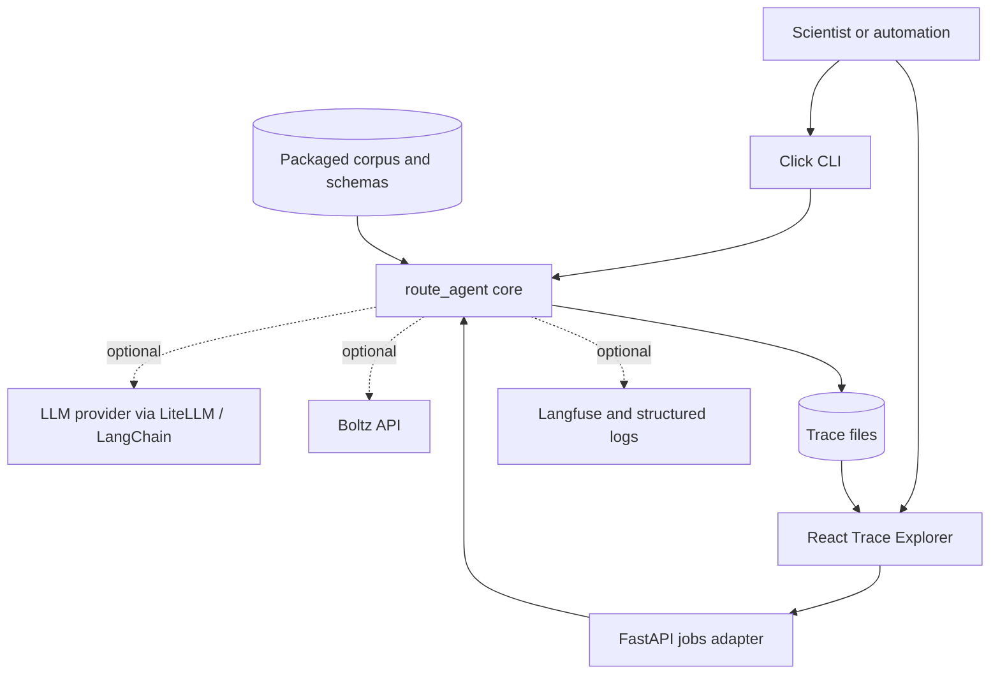
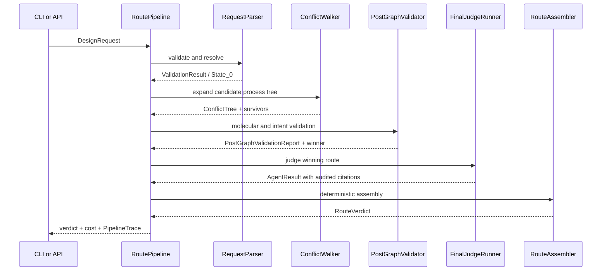

# Architecture

`route-agent` is a ports-and-adapters application around a deterministic
chemistry pipeline with bounded model-assisted judgment. The public product is
a `RouteVerdict`; the internal audit artifact is a `PipelineTrace`.

## System context



The adapters do not implement chemistry. CLI and API both use factories in
`route_agent.composition.wiring`, so validation, model behavior, route
selection, and verdict assembly are identical across interfaces.

## Package boundaries

| Area | Responsibility |
| --- | --- |
| `src/route_agent/` | Domain models, parser, corpus, conflict walker, molecular validation, agent runtime, verdict assembly, tracing |
| `src/route_agent/composition/` | Dependency construction shared by all adapters |
| `src/route_agent/services/` | Request-loading services without terminal or HTTP concerns |
| `src/route_agent_cli/` | Click command tree, keyring, stderr explanation, stdout/file output |
| `src/route_agent_api/` | Local asynchronous jobs, progress state, persisted trace lookup |
| `trace-viewer/` | React presentation of jobs and `PipelineTrace` |
| `data/` | Authoring copies of corpus, schemas, examples, and official scorer |
| `src/route_agent/resources/` | Runtime copies shipped in the wheel |
| `research/` | Writable literature sandbox/cache in a source checkout |
| `infra/` | Optional local observability services |

Enforced dependency direction:

```text
route_agent_cli ─┐
                 ├──> route_agent
route_agent_api ─┘

route_agent_api -/-> route_agent_cli
route_agent     -/-> route_agent_cli | route_agent_api
```

The architecture tests in `tests/architecture/` guard these boundaries.

## End-to-end pipeline

`RoutePipeline.run()` is the orchestration boundary:



### 1. Request validation

`route_agent.parser.request_parser.RequestParser`:

1. validates the one-letter sequence and declared non-standard residues;
2. resolves and validates modification sites;
3. structures free-text parent features when a model is enabled;
4. binds requested families to corpus process IDs;
5. applies whole-sequence transforms and remaps sites;
6. computes protecting-group occupancy;
7. selects resin from the parent C terminus;
8. emits immutable `State_0`.

Index arithmetic, enum validation, site validity, resin selection, and sequence
transforms are deterministic. Invalid sites or sequences fail the root;
recoverable uncertainty degrades it.

### 2. Conflict-tree walk

`route_agent.conflict.walker.ConflictWalker` stores states in a NetworkX
directed graph.

For each requested modification:

1. the corpus provides one or more candidate process IDs;
2. every current frontier node is paired with each candidate;
3. protecting groups are rebuilt from the residue census, `prior.history`,
   and the candidate process, then `check_compatibility` evaluates that
   candidate state;
4. a deterministic protection error fails the node without an agent call;
5. passing children keep the evaluated occupancy and remain on the frontier;
6. chemical failures are pruned;
7. degraded scientific uncertainty may remain, while infrastructure failures
   and timeouts are recorded as unknown and removed from the frontier.

Sibling checks run sequentially. Each live compatibility call executes with a
process deadline so one hung provider call cannot block the whole walk.

The ledger is the chemistry notebook carried by each state: protection,
available handles, catalysts, topology, process history, product fragments,
route step, and sequence snapshot.

### 3. Post-graph validation

`route_agent.post_graph.validator.PostGraphValidator` examines every surviving
leaf:

1. builds a molecular recipe from the leaf ledger;
2. assembles the product graph with the fragment catalog;
3. performs deterministic RDKit 2D sanitization, formula, exact mass, and
   physicochemical descriptors;
4. optionally calls Boltz for 3D structure output;
5. calls `check_intent` only for 2D-valid candidates;
6. deterministically selects the winner and records ties.

Boltz is skipped when its key is absent, `--no-model` is active, or
`ROUTE_AGENT_MOLECULAR_SKIP_3D=true`. Skipping 3D adds an explicit unknown and
does not suppress 2D evidence.

### 4. Final judgment and citation gate

`FinalJudgeRunner` receives only the winning path, route draft, molecular
evidence, intent result, and accumulated unknowns. It invokes `final_judge`
once.

The citation gate then:

- accepts explicit inference provenance;
- verifies corpus and external references;
- removes unverifiable or content-thin citations;
- records the missing evidence as unknown;
- lowers confidence when evidence quality requires it.

The model result is advisory and still does not own the final verdict enum.

### 5. Deterministic assembly

The route is reconstructed once, backwards from the selected leaf to the root.
Deterministic cleavage, purification, and QC steps are appended. The assembler
then consolidates findings and enforces:

- the verdict ladder;
- conflict-kind and severity enums;
- confidence floors;
- route/verdict coherence;
- schema-exact serialization.

Only this layer writes `RouteVerdict.verdict`.

## Deterministic and model-owned decisions

| Deterministic | Model-assisted |
| --- | --- |
| Pydantic input/output contracts | Structuring genuinely free-form parent features |
| Sequence and site arithmetic | Process compatibility against scientific context |
| Family/process lookup | Whether a valid product supports the requested intent |
| Protecting-group census and resin selection | Final evidence/gap assessment |
| Candidate-tree construction and pruning rules | Literature search/tool use inside bounded objectives |
| RDKit product construction and 2D descriptors | |
| Winner-selection ordering and route reconstruction | |
| Citation verification, confidence floors, and verdict ladder | |

`--no-model` replaces model judgment with explicit unknown results. It is not a
mock that pretends checks passed.

## State, events, traces, and logs

These four concepts are intentionally separate:

| Concept | Purpose |
| --- | --- |
| Domain state | Immutable chemistry and decision data used by the pipeline |
| `PipelineEvent` | In-process progress stream for `--explain` and API jobs |
| `PipelineTrace` | Persisted, structured audit artifact for UI and debugging |
| Structured log | Operational telemetry with correlation IDs |

`RoutePipeline` composes a recording observer, logging observer, and optional
adapter observer. This prevents presentation concerns from entering the core.

Correlation IDs:

- `run_id`: one pipeline execution;
- `request_id`: the caller's design identity;
- `job_id`: one API submission.

The same values appear in logs, traces, HTTP response headers, and optional
Langfuse metadata.

## Persistence model

| Data | Storage | Lifetime |
| --- | --- | --- |
| Public CLI verdict | stdout or caller-selected file | Caller-owned |
| CLI trace | `--trace-dir`, default `traces/` | Persistent file |
| Active API jobs | In-process `JobStore` | Lost on API restart |
| Completed API traces | `traces/jobs/{job_id}/` | Persistent file |
| Family compatibility cache | In-process `CompatCache` | One composed runtime |
| Literature cache | `research/` or XDG cache | Persistent writable cache |
| Packaged corpus and schemas | Wheel resources | Versioned with package |
| Logs | stderr and optional JSONL | Configurable |
| Langfuse/Grafana data | Optional Docker volumes | Until stack/volumes removed |

Atomic trace writes make completed files safe to discover after a restart. The
API trace index is derived from disk rather than from a database.

## API and concurrency

`route-agent-api` is a local adapter:

- `ThreadPoolExecutor(max_workers=1)`;
- at most one queued/running job;
- `409 Conflict` for concurrent submission;
- thread-safe in-memory state protected by a lock;
- completed trace fallback from disk;
- no authentication or authorization;
- CORS restricted to localhost Vite origins;
- bound to `127.0.0.1:8000`.

This design avoids introducing a queue or database for a local demo. A
production service would require durable jobs, idempotency, cancellation,
authentication, rate limits, distributed locking, remote artifact storage, and
retention policies.

## Failure semantics

The pipeline distinguishes chemistry from infrastructure:

| Condition | Representation |
| --- | --- |
| Invalid request JSON/schema | CLI exit `1` / FastAPI validation response |
| Invalid sequence or site | Failed validation root |
| Candidate chemically incompatible | Failed node, pruned |
| Model disabled or scientifically uncertain | Degraded result / unknown |
| Model invocation exception or timeout | Infrastructure unknown, candidate removed from frontier |
| Missing Boltz key or skipped 3D | 2D result retained, 3D unknown recorded |
| No surviving candidate | No winner; final judge skipped |
| Unverified citation | Citation removed, unknown added, confidence lowered |
| Optional observability unavailable | Pipeline continues |

This prevents an operational outage from being reported as chemical
impossibility and prevents missing evidence from being reported as feasibility.

## Key architectural decisions

### Hybrid rather than fully agentic

Scientific language benefits from model judgment, but contracts and chemistry
bookkeeping require reproducibility. Model calls are therefore limited to named
objectives and surrounded by deterministic gates.

### Corpus profiles rather than a precomputed conflict matrix

A static pairwise matrix cannot capture ordering, occupied handles, protecting
groups, catalysts, or topology. Candidate processes are looked up from the
family corpus and evaluated against semantic categories derived from the
current ledger.

### Public result separated from audit trace

Consumers need a stable, compact verdict schema. Developers and scientists
need intermediate states, model calls, costs, molecular evidence, and events.
Maintaining two artifacts avoids leaking internal churn into the public API.

### Dependency injection and composition root

Parser, walker, molecular analyzer, judge, assembler, observers, and tracer are
injected. Tests can use deterministic fakes, and adapters cannot silently
construct a different pipeline.

### Fail-open observability, fail-honest judgment

Telemetry is optional and must not block science. Missing scientific evidence,
however, must affect unknowns and confidence. Those two failure policies are
different by design.

### Single-worker local API

The API exists to support Trace Explorer, not to claim production scalability.
Serial execution also bounds local model cost and avoids concurrent writes to
the demo trace workspace.

## Tests that protect the design

- `tests/architecture/`: import boundaries;
- `tests/integration/test_cli_contracts.py`: stdout/stderr and command contracts;
- `tests/integration/test_api_jobs.py`: API/job lifecycle;
- `tests/unit/pipeline/`: stage orchestration and trace creation;
- `tests/unit/parser/`: deterministic validation;
- `tests/unit/test_conflict_walker.py`: tree and failure semantics;
- `tests/unit/molecular/`: graph, descriptors, and Boltz adapter;
- `tests/unit/post_graph/`: intent, winner, and final judge;
- `tests/unit/verdict/`: schema and verdict assembly;
- `tests/unit/observability/`: logging, correlation, and redaction.

The official 12-case evaluation complements these tests but is not a substitute
for them.
