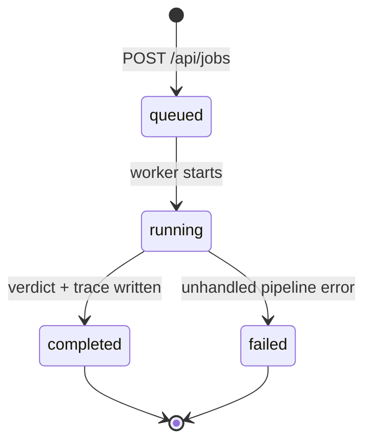

# Trace Explorer

Trace Explorer is the local React UI for creating a `DesignRequest`, following
pipeline progress, and inspecting a completed `PipelineTrace`. It is a
developer/scientist tool, not a production web application.

## Start the UI

From the repository root:

```bash
uv sync --frozen
uv run route-agent-api
```

In a second terminal:

```bash
cd trace-viewer
npm ci
npm run dev
```

Open the URL printed by Vite, normally `http://127.0.0.1:5173`.

The Python API binds to `http://127.0.0.1:8000`. During development, Vite
proxies browser requests under `/api` to that address.

## Launch-screen workflows

### New request

1. Select **New request**.
2. Enter the request ID, parent peptide, sequence, C terminus, annotations,
   modifications, and intent.
3. Add or remove modification rows as needed.
4. Submit.
5. Follow the current phase and activity until the trace opens.

The browser performs basic contract validation before submission. FastAPI and
the core Pydantic models remain the authoritative validation boundary.

The UI submits normal live-model jobs. To run without a model, either use the
API directly with `POST /api/jobs?no_model=true` or produce a trace with the
CLI and upload it.

### Open a persisted job trace

The launch page polls `GET /api/traces` while idle. Select a listed run to open
the trace stored under `traces/jobs/{job_id}/`.

Because the list comes from disk, completed runs remain discoverable after an
API restart even though active job state is in memory.

### Upload a trace

Drop or choose a `.trace.json` produced by:

```bash
route-agent run request.json --trace-dir traces
```

Uploaded content is parsed and displayed in the browser. It is not sent to the
API or copied to the server.

## Trace views

| Tab | Shows |
| --- | --- |
| **Home** | Request, final verdict, confidence, selected candidate, route, conflicts, unknowns, and cost summary |
| **Validate** | `State_0`, sequence resolution, site mapping, family bindings, protection/resin decisions, and validation errors |
| **Walk** | Conflict-tree topology, frontier changes, candidates, recomputed protecting groups, state diffs, findings, and process provenance |
| **Molecular** | Product recipe, 2D validity, formula, descriptors, fragments, optional 3D structure, and molecular unknowns |
| **Intent** | Intent checks for surviving candidates and their evidence |
| **Judge** | Winning route judgment, citations, confidence, findings, and remaining gaps |
| **LLM** | Model calls, objectives, token/cost metadata, tool calls, and captured payloads when enabled |
| **JSON** | Complete raw `PipelineTrace` |

The molecular view uses 3Dmol when structure content is present.

## URLs and restoration

Trace Explorer keeps the selected view in the URL:

```text
/jobs/{job_id}?tab=molecular
/requests/{request_id}?tab=walk
```

- `/jobs/{job_id}` first checks in-memory job state, then falls back to the
  persisted trace.
- `/requests/{request_id}` resolves through the stored-trace list and opens the
  matching job.
- `?tab=` accepts `home`, `validate`, `walk`, `molecular`, `intent`, `judge`,
  `llm`, or `json`.

These are client-side SPA routes. Vite handles them during local development;
another static host would need an index fallback.

## Jobs API

The API is intentionally small:

| Method | Endpoint | Result |
| --- | --- | --- |
| `GET` | `/api/health` | Settings/resource readiness and active-job summary |
| `POST` | `/api/jobs?no_model=false` | Validate and queue one request; returns `202` |
| `GET` | `/api/jobs/{job_id}` | Current status, phase, progress, and final summary |
| `GET` | `/api/jobs/{job_id}/trace` | Completed `PipelineTrace` |
| `GET` | `/api/traces` | Index of completed traces found on disk |

Example:

```bash
curl -X POST \
  'http://127.0.0.1:8000/api/jobs?no_model=true' \
  -H 'Content-Type: application/json' \
  --data-binary @request.json
```

Job phases exposed to the UI are:

```text
validate → walk → molecular → intent → judge → assemble
```

The core emits richer `PipelineEvent` values; the API adapter maps them onto
these presentation phases.

## Job lifecycle and persistence



Operational properties:

- one `ThreadPoolExecutor` worker;
- one queued/running job maximum;
- `409 Conflict` for a second submission;
- active state protected by an in-process lock;
- active state lost on process restart;
- completed trace written to `traces/jobs/{job_id}/`;
- disk trace can be reopened even when the job no longer exists in memory;
- no cancellation or deletion endpoint.

## Security and deployment scope

The API:

- binds only to loopback;
- has no authentication;
- permits CORS only from `localhost:5173` and `127.0.0.1:5173`;
- writes traces to a local relative directory;
- accepts one user workload at a time.

Do not expose it directly to a network. A production deployment would need
authentication, authorization, request/body limits, CSRF/CORS review, durable
jobs, quotas, cancellation, remote artifact storage, retention, and secret
management.

Model prompts and responses may contain design data. They are excluded from
persisted observability payloads unless `ROUTE_AGENT_TRACE_PAYLOADS=true`.
Enable that option only in a controlled local environment.

## Frontend development

```bash
cd trace-viewer
npm ci
npm run lint
npm run typecheck
npm run build
npm run preview
```

Important frontend areas:

| Path | Responsibility |
| --- | --- |
| `src/App.tsx` | Routing, trace loading, job restoration, and tab composition |
| `src/components/LaunchView.tsx` | New/open/upload workflows |
| `src/components/DesignRequestForm.tsx` | Request editing |
| `src/hooks/usePipelineJob.ts` | Submit and poll lifecycle |
| `src/hooks/useStoredTraces.ts` | Persisted-trace polling |
| `src/components/views/` | Trace stage views |
| `src/lib/parseTrace.ts` | Uploaded/API trace parsing |
| `src/lib/api.ts` | HTTP adapter |
| `src/types/trace.ts` | UI trace contract |

When the Python `PipelineTrace` schema changes, update frontend normalization
and types together and verify both historical trace opening and fresh jobs.

## Troubleshooting

| Symptom | Resolution |
| --- | --- |
| Launch page says the API is unavailable | Start `uv run route-agent-api`; verify `/api/health` on port 8000 |
| Browser request receives `409` | Another job is active; wait for it to complete |
| Job URL returns unknown after restart | Open it from the stored trace list; only active metadata was in memory |
| Stored list is empty | Complete an API job or place a valid job trace under `traces/jobs/{job_id}/` |
| Uploaded file is rejected | Upload the internal `.trace.json`, not the public verdict JSON |
| Molecular tab has no 3D model | The run skipped Boltz or had no `BOLTZ_API_KEY`; inspect molecular unknowns |
| LLM payloads are absent | This is the secure default; enable `ROUTE_AGENT_TRACE_PAYLOADS` only for local debugging |
| A deep link shows a blank/404 page on another host | Configure SPA fallback to `index.html` |
